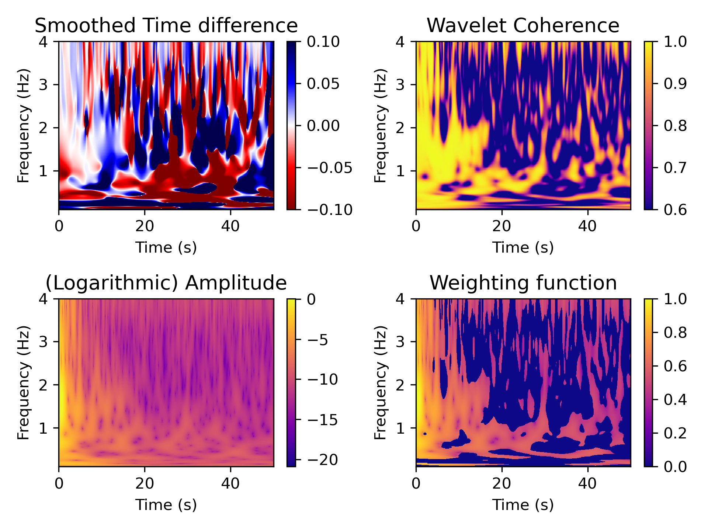

# Hydrosphere: monitoring, space-time seismic interferometry, sensitivity kernels, wavelet theory
## Skience2023 practical on dv/v monitoring using the Wavelet method and MSNoise

## Authors:
* Raphael De Plaen([@RDePlaen](https://github.com/RDePlaen))
* Thomas Lecocq ([@seismotom](https://github.com/ThomasLecocq))

## Introduction:
 

  </img>

The notebooks provided for this morning's class are a continuation of Monday afternoon's introduction to MSNoise. Here we also have a illustration of ways to hack MSNoise to leverage its benefits while still using your own codes. 
Following Shujuan Mao's theoretical introduction, we use the wavelet method on pre-computed cross-correlations of the station CI.LJR in California and compare the results to those in the literature.
1. How to hack msnoise to implement your own dv/v measurement method.
2. How to use the wavelet method to efficiently measure dv/v over a broad frequency range and with high spectral resolution
3. how to assess the depth of the measured changes using surface waves sensitivity kernels

## Requirements
All the CCF files must be copied in the "STACK" folder.

These Python 3  codes rely mainly on the [MSNoise](https://github.com/ROBelgium/MSNoise) api, the [PyCWT](https://github.com/regeirk/pycwt), and the [disba](https://github.com/keurfonluu/disba) packages.

## References:
Mao, S.; Mordret, A.; Campillo, M.; Fang, H.; van der Hilst, R. D. On the Measurement of Seismic Travel-Time Changes in the Time-Frequency Domain with Wavelet Cross-Spectrum Analysis. Geophys. J. Int. 2019. https://doi.org/10.1093/gji/ggz495.
Clements, T.; Denolle, M. A. The Seismic Signature of California’s Earthquakes, Droughts, and Floods. J. Geophys. Res. Solid Earth 2023, 128 (1). https://doi.org/10.1029/2022JB025553.